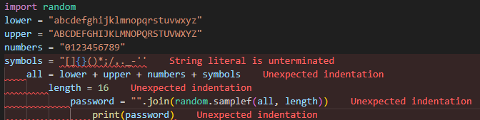

# Raport o błędzie

## Numer / identyfikator błędu
### sprawdzenie.py
## Tytuł błędu

## Priorytet
### P2
## Platforma / środowisko
### PC
## Opis
Nie zamknięte nawiasy, nie potrzebne indenty, błędy ortograficzne.
## Kroki do reprodukcji
1. Zamknięcie nawiasów string (Linia 5), 
2. Usunięcie indentów (Linie 6, 7, 8, 9), 
3. Poprawienie błędów ortograficznych.
## Oczekiwany i rzeczywisty wynik
Poprawienie kodu
## Zrzut ekranu

